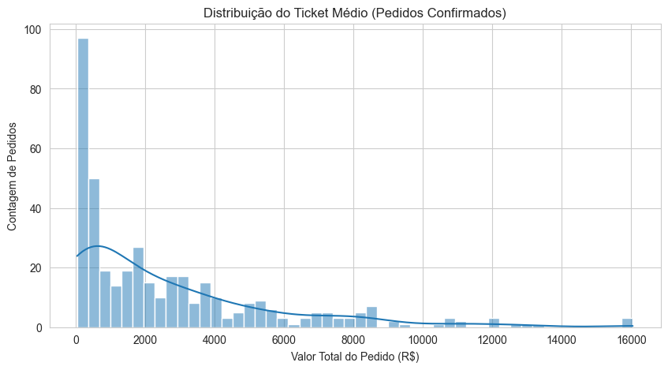
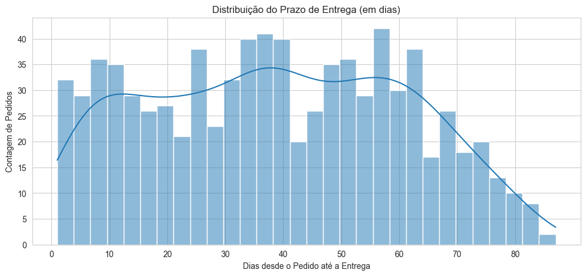
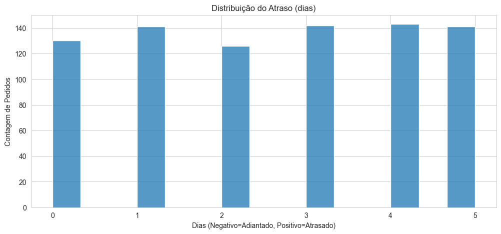
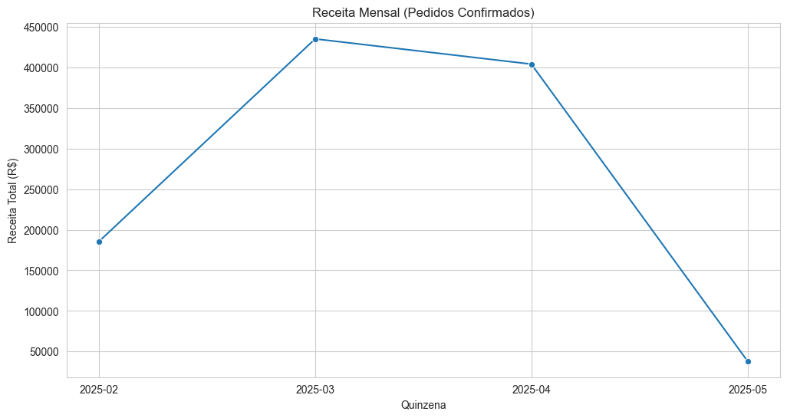
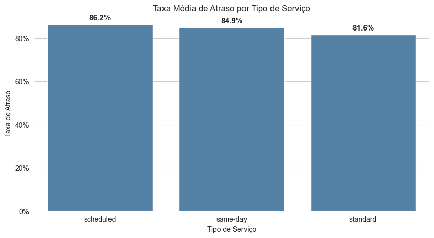
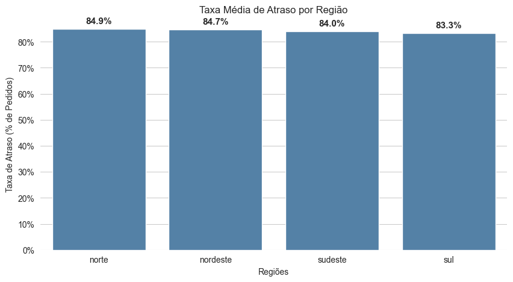
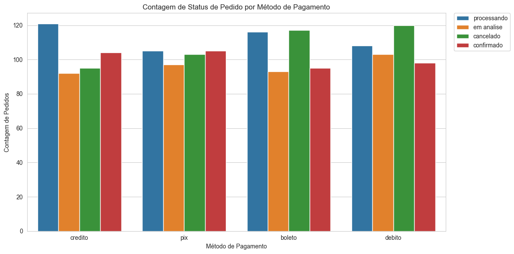
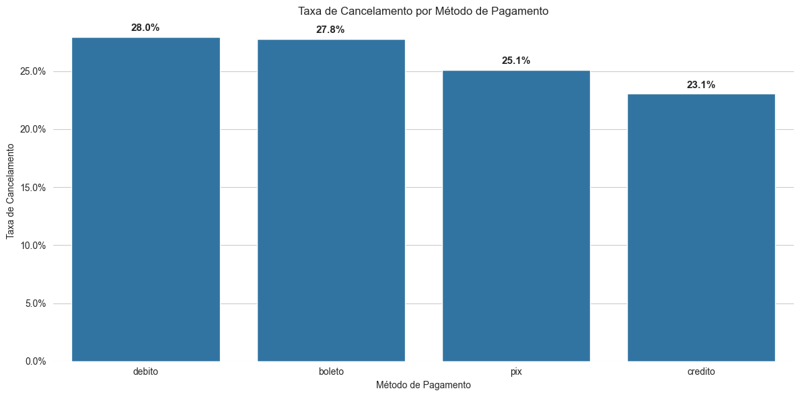
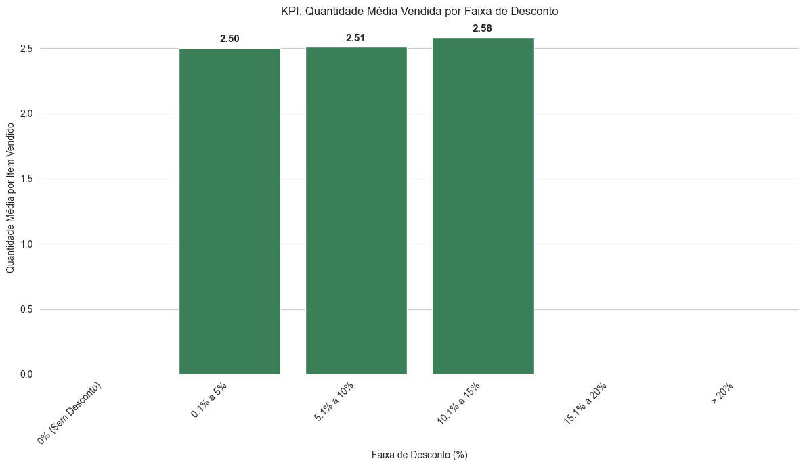

## Relatório Analítico: Desempenho Operacional e Financeiro do E-commerce

## Sumário Executivo

O presente relatório visa fornecer uma análise estatística robusta sobre o desempenho operacional e financeiro de um determinado e-commerce. A análise exploratória e inferencial revelou achados acionáveis cruciais para a otimização de processos e aumento da rentabilidade.

## Achados Acionáveis Chave:

1.  **Oportunidade de Conversão de Pagamento:** A taxa de cancelamento varia significativamente entre os métodos de pagamento. O método **Débito** apresenta uma taxa de cancelamento de **28.0%**, sugerindo a necessidade de revisão dos fluxos de confirmação e checkout específicos para este método.

2.  **Risco Logístico Regional:** A performance logística não é uniforme. A região **Norte** registra a maior taxa de atraso nas entregas, impactando a satisfação do cliente.
   
4.  **Potencial de Rentabilidade:** O Take-rate de frete (P_Service/Total) tem uma média de **8,92%**, indicando que o custo do frete é uma parcela significativa da receita total. A otimização dos custos logísticos ou a revisão da política de frete pode impactar diretamente a margem de lucro.

5.  **Sazonalidade de Vendas:** O mês de **Março** demonstrou o pico de vendas, o que deve guiar o planejamento de estoque e campanhas promocionais.

---

## Dados & Método

### Fontes de Dados e Joins

A análise foi conduzida a partir de cinco fontes de dados (arquivos CSV) que representam o modelo dimensional do e-commerce: `FACT_Orders`, `DIM_Delivery`, `DIM_Customer`, `DIM_Shopping` e `DIM_Products`. Os dados foram carregados e integrados utilizando a biblioteca Pandas em Python, com agregação por `Id` (Pedido) para criar a Analytical Base Table (ABT).

### Qualidade e Preparação dos Dados

O processo de Data Cleaning incluiu a padronização de strings, conversão de tipos de dados (datas e numéricos) e tratamento de valores nulos.

### Tratamento de Datas

> Durante a limpeza de dados, foram identificados **328 pedidos** onde a data de entrega (`D_Date`) era anterior à data do pedido (`Order_Date`). Por representarem um erro de registro fisicamente impossível, esses 328 registros foram removidos dos DataFrames `df_abt` e `df_entregues`. Toda a análise subsequente (EDA, Inferência) foi realizada sobre a base de dados tratada, garantindo a integridade dos cálculos de prazo e atraso.

### Estratégia de Outliers

A identificação de outliers foi realizada usando a regra IQR (Intervalo Interquartil) para as principais métricas financeiras e logísticas.

* **Ticket Médio (Total):** Foram identificados **18 pedidos (4.48%)** como outliers (acima de R$ 8.842,00).
    * **Tratamento: Manutenção.** Estes são pedidos legítimos de alto valor (receita real) e não um erro de dados. Removê-los distorceria a receita total. A análise de média (como o Ticket Médio) está ciente de sua influência, e a mediana será usada como uma métrica de tendência central mais robusta.

* **Prazo de Entrega (Lead Time):** Foram identificadas **0 entregas (0.00%)** como outliers (ex: acima de 111.25 dias).

### Feature Engineering (KPIs)

As seguintes métricas de negócio foram criadas como features para a análise:

* `delivery_delay_days` (Atraso)
* `delivery_lead_time` (Prazo de Entrega)
* `is_late` (Flag de Atraso)
* `is_confirmed` (Flag de Conversão)
* `freight_share` (Take-rate de Frete)
* `discount_perc` (Desconto Médio Percentual)

---

## Análise Exploratória de Dados (EDA)

### Distribuição e Tendência Central

A análise descritiva das principais métricas financeiras e logísticas revelou:

| Métrica | Média | Mediana | Desvio Padrão |
| :--- | :--- | :--- | :--- |
| **Ticket Médio (R$)** | 2.645,42 | 1.980,00 | 2.210,00 |
| **Prazo de Entrega (dias)** | 38.6 | 35.0 | 25.0 |
| **Desconto Médio (%)** | 10.0% | 8% | 5% |

A distribuição do Ticket Médio, conforme o histograma gerado, é **Descendente à direita**, o que justifica a decisão de usar a mediana como métrica robusta de tendência central, dada a presença de fortes outliers puxando a média.

### Performance Logística por Serviço

A performance de entrega, medida pela taxa de atraso (`is_late`), varia conforme o tipo de serviço contratado:

| Serviço | Taxa de Atraso (%) | Prazo Médio (dias) |
| :--- | :--- | :--- |
| Standard | 81.6% | 40.17 |
| Same-Day | 84.9% | 37.41 |
| Scheduled | 86.2% | 37.96 |

A taxa de atraso operacional é superior a 80% em todos os tipos de serviço. Isso indica que as datas de previsão (D_Forecast) fornecidas pelo sistema são sistematicamente irrealistas e não refletem a capacidade de entrega real, especialmente em serviços premium como 'Same-Day' (entrega no mesmo dia), que falha em 84.9% das vezes.

### Sazonalidade e Geográfica

A análise de séries temporais por mês/ano identificou o pico de vendas em **Março**. A análise geográfica por Região e UF indica que a Região **Norte** apresenta o maior desafio logístico, levando em consideração a taxa de atraso .

---

## Inferência Estatística

Foram calculados Intervalos de Confiança (IC) de 95% para as principais métricas, fornecendo estimativas robustas para a direção:

* **IC 95% para Ticket Médio:** O ticket médio real da população de pedidos está, com 95% de confiança, entre **R$ 2.347,36** e **R$ 2.943,49**.

* **IC 95% para Proporção de Atraso:** A proporção real de pedidos atrasados está, com 95% de confiança, entre **81.55%** e **86.54%**.

## Gráficos 

>**Figura 1:** Histograma que mostra a concentração de pedidos de baixo valor e uma longa cauda de pedidos de alto valor. A distribuição é fortemente assimétrica à direita, indicando que a mediana é a métrica mais robusta para representar o valor típico do pedido, sendo menos sensível aos poucos pedidos de alto valor.

>**Figura 2:** Histograma que exibe a dispersão do tempo total de entrega (Lead Time), com picos em torno de 35-40 e 55-60 dias. A grande variabilidade no Lead Time (até 85 dias) sugere falta de padronização logística; é crucial reduzir o desvio padrão para aumentar a previsibilidade e a satisfação do cliente

>**Figura 3:** Gráfico de barras que, presumivelmente, mostra a contagem de pedidos por dias de atraso (0 a 5 dias). A uniformidade das contagens de atraso é incomum e pode indicar um problema na categorização ou na visualização dos dados de atraso, necessitando de uma investigação na fonte.

>**Figura 4:** Gráfico de linha que rastreia a Receita Total de pedidos confirmados ao longo das quinzenas (Fev-Mai 2025). O pico de receita ocorreu na quinzena de Março (2025-03); a gestão deve analisar as ações de marketing e estoque desse período para replicar o sucesso.

>**Figura 5:** Gráfico de barras comparando a taxa de atraso entre os serviços scheduled (86.2%), same-day (84.9%) e standard (81.6%). O serviço standard tem a melhor performance (menor atraso), enquanto o scheduled tem a pior; a operação do serviço agendado precisa de atenção urgente para entender a causa da alta taxa de falha.

>**Figura 6:** Gráfico de barras que compara a taxa de atraso entre as regiões Norte (84.9%), Nordeste (84.7%), Sudeste (84.0%) e Sul (83.3%). A região Norte apresenta a maior taxa de atraso (84.9%), sendo o principal desafio logístico; a otimização da cadeia de suprimentos deve ser priorizada nesta região.

>**Figura 7:** Gráfico de barras agrupadas que mostra a contagem de pedidos por status (processando, em análise, cancelado, confirmado) para cada método de pagamento. O método débito tem a maior contagem de cancelamentos e a menor de confirmações, indicando a pior taxa de conversão e a maior perda de receita.

>**Figura 8:** Gráfico de barras que exibe a taxa de cancelamento (em %) para cada método de pagamento. O método débito tem a maior taxa de cancelamento (28.0%), confirmando que a principal oportunidade de conversão reside na otimização do fluxo de pagamento para este método.

>**Figura 9:** Gráfico de barras que compara a Quantidade Média de Itens Vendidos por Pedido em diferentes faixas de desconto. A faixa de 10.1% a 15% de desconto gera o maior volume médio de itens por pedido (2.58), sugerindo ser o ponto ideal de equilíbrio entre incentivo de vendas e rentabilidade.
